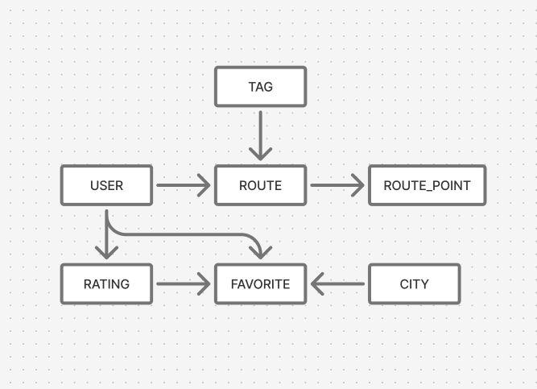
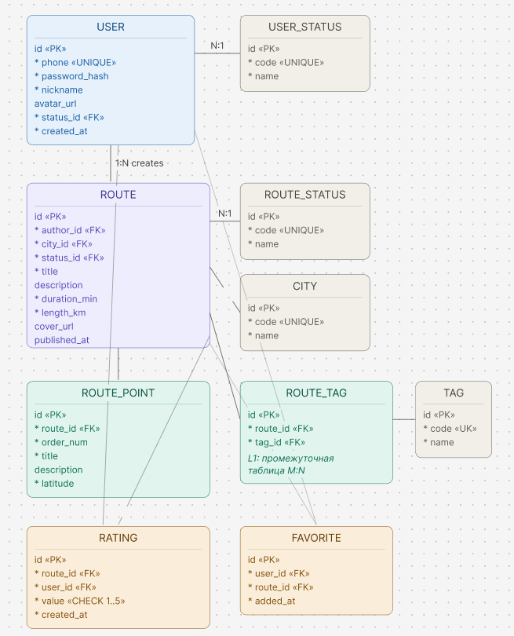
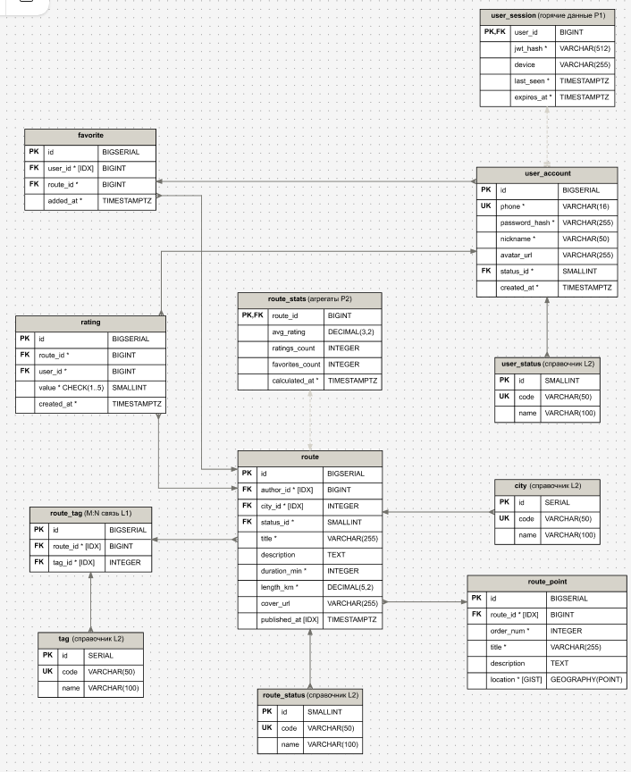

# ERD — модель данных

Модель данных представлена на трёх уровнях детализации: концептуальная, логическая, физическая.

## Уровень 1. Концептуальная модель

Семь сущностей Spot:

- **USER** — авторизованный пользователь.
- **ROUTE** — маршрут, созданный автором.
- **ROUTE_POINT** — точка маршрута.
- **RATING** — оценка маршрута (1–5).
- **FAVORITE** — добавление маршрута в избранное.
- **CITY** — город (справочник).
- **TAG** — тематический тег.

## Уровень 2. Логическая модель

### Промежуточная таблица связей

`ROUTE` ↔ `TAG` — связь M:N. На концептуальном уровне была прямой, здесь раскрыта через ассоциативную таблицу `ROUTE_TAG`.

### Справочники

| Справочник | Назначение |
| --- | --- |
| `USER_STATUS` | Статусы пользователя: активен / заблокирован / удалён |
| `ROUTE_STATUS` | Статусы маршрута: черновик / опубликован / снят с публикации |
| `CITY` | Бизнес может добавлять новые города через админку |
| `TAG` | Теги администрируются, у них могут появиться атрибуты (иконка, порядок в фильтре) |

`USER_STATUS` и `ROUTE_STATUS` — справочники ради ссылочной целостности.

`value` в `RATING` остался `smallint` с `CHECK 1-5` — это `enum`, а не справочник: набор оценок зашит в бизнес-логике и не будет меняться без изменения кода.

### Кратности и обязательность связей

| Связь | Кратность | Комментарий |
| --- | --- | --- |
| `USER ||--o{ ROUTE` | 1 : 0..N | Пользователь может не иметь ни одного маршрута (он может быть только читателем) |
| `ROUTE ||--|{ ROUTE_POINT` | 1 : 1..N | Маршрут без точек не существует |
| `ROUTE }o--|| CITY` | 0..N : 1 | Маршрут обязательно привязан к городу |

## Уровень 3. Физическая модель

### Типы данных

| Тип | Где используется | Обоснование |
| --- | --- | --- |
| `BIGSERIAL` | `user_account`, `route`, `route_point`, `rating`, `favorite` | С учётом роста. `INTEGER` имеет запас до ~2,1 млрд, но `BIGINT` надёжнее для таблиц, которые могут расти |
| `SERIAL` | Справочники (`city`, `tag`) | Тысячи, не миллионы записей |
| `SMALLINT` | PK справочников статусов | Справочники малы, экономия на каждой строке |
| `TIMESTAMPTZ` | Все временные метки | Spot работает по всей России с разными часовыми поясами |
| `DECIMAL(5,2)` | `length_km` | Точная арифметика без ошибок float |
| `DECIMAL(3,2)` | `avg_rating` | Точная арифметика без ошибок float |

### Оптимизация: разделение горячих данных в `user_session`

Данные сессии (`JWT`, `last_seen`, `device`, `expires_at`) обновляются при каждом запросе к API — сотни раз в день на пользователя. Профиль `user_account` при этом стабилен: имя, телефон, аватар меняются раз в год.

Если держать всё в одной таблице, каждый запрос блокирует строку целиком. Поэтому горячие поля вынесены в отдельную таблицу со связью 1:1 через `user_id`.

### Оптимизация: таблица агрегатов `route_stats`

Добавлена таблица `route_stats` с предрасчитанными значениями `avg_rating`, `ratings_count`, `favorites_count`. Обновляется фоновым процессом — это снижает нагрузку при чтении каталога.

### Индексация

| Тип индекса | На чём | Назначение |
| --- | --- | --- |
| FK-индексы | `author_id`, `city_id`, `route_id`, `tag_id`, `user_id` | Ускорение JOIN |
| B-tree | `route.published_at` | Сортировка раздела «Новое» в каталоге |
| `UNIQUE` | `user_account.phone` | Быстрая проверка существования аккаунта при регистрации |
| `GIST` | `route_point.location` | Геопространственные запросы для раздела «Поблизости» |
