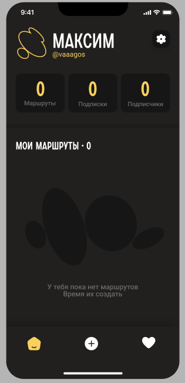
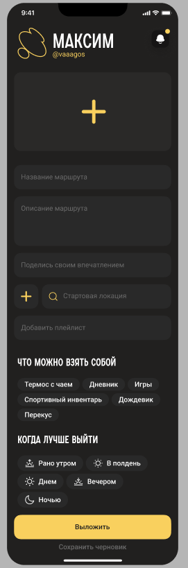
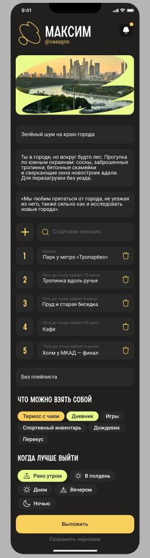

# Макеты экранов

Ниже приведены макеты основных экранов, связанных с созданием и публикацией маршрутов авторами.

## Профиль автора

Стартовый экран автора. Сверху — никнейм и счётчики (маршруты, подписки, подписчики). Снизу — список собственных маршрутов автора с пустым состоянием для нового пользователя.

## Создание маршрута — пустая форма

Форма создания нового маршрута. Поля: обложка, название, описание, впечатление автора, стартовая локация, плейлист, чек-листы «Что можно взять с собой» и «Когда лучше выйти». Внизу — кнопки «Выложить» и «Сохранить черновик».

## Создание маршрута — заполненная форма

Тот же экран, но с заполненными данными: загруженной обложкой, заголовком «Зелёный шум по краю города», описанием, последовательностью точек маршрута (1. Парк у метро «Тропарёво», 2. Тропинка вдоль ручья, 3. Пруд и старая беседка, 4. Кафе, 5. Холм у МКАД — финал) и выбранными чек-листами.

## Эндпоинты, используемые в этих экранах

| Метод и путь | Назначение |
| --- | --- |
| `GET /user/profile` | Получить данные профиля (имя, username, количество маршрутов, подписчиков) |
| `GET /routes/my` | Получить список своих маршрутов |
| `GET /routes/{id}` | Получить данные конкретного маршрута |
| `POST /routes/draft` | Создать новый черновик маршрута |
| `PATCH /routes/{id}` | Обновить данные маршрута (название, описание, теги и т. д.) |
| `POST /files/upload` | Загрузить изображение (обложка) |
| `POST /routes/{id}/points` | Добавить точку маршрута |
| `DELETE /routes/{id}/points/{pointId}` | Удалить точку |
| `PATCH /routes/{id}/points/reorder` | Изменить порядок точек |
| `GET /locations/search?q=` | Поиск локации (для выбора точки старта и маршрута) |
| `GET /routes/meta/items` | Список «что взять с собой» |
| `GET /routes/meta/time` | Список «когда лучше выйти» |
| `POST /routes/{id}/save-draft` | Сохранить маршрут как черновик |
| `POST /routes/{id}/publish` | Опубликовать маршрут |

Полная спецификация эндпоинтов — в разделе [API Reference](../api/api-reference.md).
