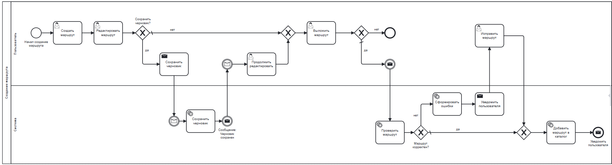
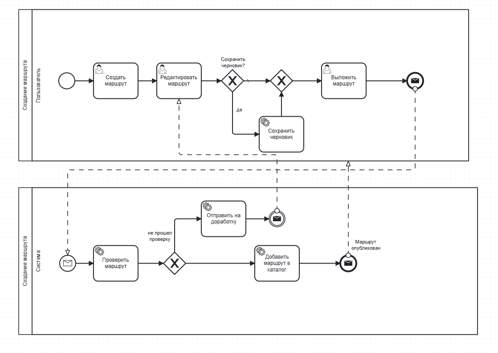
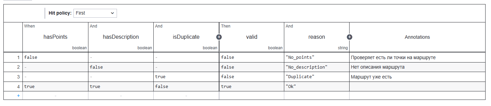

# Моделирование процессов в BPMN

## Основная диаграмма BPMN

Диаграмма описывает процесс публикации маршрута: автор создаёт маршрут, заполняет точки, отправляет на модерацию, модератор проверяет контент, после чего маршрут публикуется или возвращается на доработку.



## Альтернативный вариант с двумя пулами

В альтернативной версии разделены пулы автора и модератора — это явно показывает асинхронное межсистемное взаимодействие.



## DMN — таблица решений

Проверка маршрута перед публикацией включает множество правил, которые может понадобиться изменять без правки самого процесса. **DMN** позволяет вынести бизнес-логику в таблицу решений и управлять ею отдельно от BPMN, не нагружая диаграмму лишними шлюзами.



### Зачем выносить логику в DMN

- Масштабируемость правил.
- Возможность редактировать правила без изменения BPMN.
- Снижение визуальной сложности диаграммы.

### Логика правил

| hasPoints | hasDescription | isDuplicate | valid | reason |
| --- | --- | --- | --- | --- |
| false | — | — | false | `No_points` |
| — | false | — | false | `No_description` |
| — | — | true | false | `Duplicate` |
| true | true | false | true | `Ok` |

## Исходный XML DMN-таблицы

Описание таблицы решений в формате DMN 1.3 (для импорта в DMN-редактор):

```xml
<?xml version="1.0" encoding="UTF-8"?>
<definitions xmlns="https://www.omg.org/spec/DMN/20191111/MODEL/"
             xmlns:biodi="http://bpmn.io/schema/dmn/biodi/2.0"
             xmlns:dmndi="https://www.omg.org/spec/DMN/20191111/DMNDI/"
             xmlns:dc="http://www.omg.org/spec/DMN/20180521/DC/"
             id="definitions_0k37e9f"
             name="definitions"
             namespace="http://camunda.org/schema/1.0/dmn"
             exporter="dmn-js (https://demo.bpmn.io/dmn)"
             exporterVersion="17.7.0">
  <decision id="decision_0k37n7u" name="">
    <decisionTable id="decisionTable_0sua0zh" hitPolicy="FIRST">
      <input id="input1" label="hasPoints" biodi:width="192">
        <inputExpression id="inputExpression1" typeRef="boolean">
          <text></text>
        </inputExpression>
      </input>
      <input id="InputClause_1qoonvs" label="hasDescription">
        <inputExpression id="LiteralExpression_02qmocp" typeRef="boolean">
          <text></text>
        </inputExpression>
      </input>
      <input id="InputClause_1s5bkwr" label="isDuplicate">
        <inputExpression id="LiteralExpression_01c9vgo" typeRef="boolean">
          <text></text>
        </inputExpression>
      </input>
      <output id="output1" label="valid" name="" typeRef="boolean" biodi:width="192" />
      <output id="OutputClause_19j7uus" label="reason" typeRef="string" />
      <rule id="DecisionRule_1qrwk4j">
        <description>Проверяет, есть ли точки на маршруте</description>
        <inputEntry id="UnaryTests_1o7xgbo"><text>false</text></inputEntry>
        <inputEntry id="UnaryTests_1oe59ir"><text></text></inputEntry>
        <inputEntry id="UnaryTests_0k40sbz"><text></text></inputEntry>
        <outputEntry id="LiteralExpression_06t4scn"><text>false</text></outputEntry>
        <outputEntry id="LiteralExpression_0avni8p"><text>"No_points"</text></outputEntry>
      </rule>
      <rule id="DecisionRule_1p6y0nf">
        <description>Нет описания маршрута</description>
        <inputEntry id="UnaryTests_0bm1flk"><text></text></inputEntry>
        <inputEntry id="UnaryTests_1fempm5"><text>false</text></inputEntry>
        <inputEntry id="UnaryTests_148ulzw"><text></text></inputEntry>
        <outputEntry id="LiteralExpression_0e8uw40"><text>false</text></outputEntry>
        <outputEntry id="LiteralExpression_0fk8hgq"><text>"No_description"</text></outputEntry>
      </rule>
      <rule id="DecisionRule_0e8r2ng">
        <description>Маршрут уже есть</description>
        <inputEntry id="UnaryTests_0tqwt4x"><text></text></inputEntry>
        <inputEntry id="UnaryTests_163c9zy"><text></text></inputEntry>
        <inputEntry id="UnaryTests_0ia8ykj"><text>true</text></inputEntry>
        <outputEntry id="LiteralExpression_1bitr0q"><text>false</text></outputEntry>
        <outputEntry id="LiteralExpression_0vj5nmn"><text>"Duplicate"</text></outputEntry>
      </rule>
      <rule id="DecisionRule_1qkrrfx">
        <inputEntry id="UnaryTests_07w3r3n"><text>true</text></inputEntry>
        <inputEntry id="UnaryTests_1b219fw"><text>true</text></inputEntry>
        <inputEntry id="UnaryTests_0kd0gss"><text>false</text></inputEntry>
        <outputEntry id="LiteralExpression_0m7ibm5"><text>true</text></outputEntry>
        <outputEntry id="LiteralExpression_1hhot1x"><text>"Ok"</text></outputEntry>
      </rule>
    </decisionTable>
  </decision>
</definitions>
```
